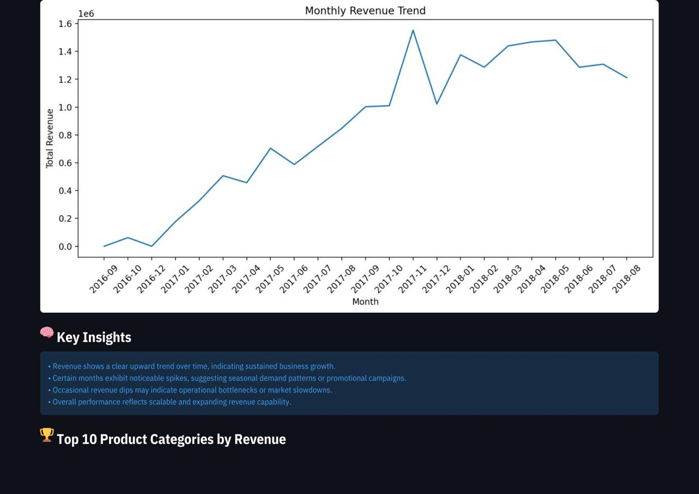
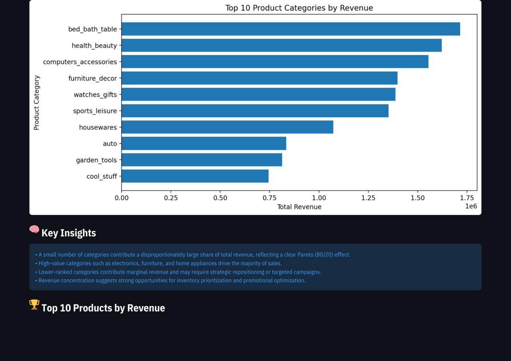
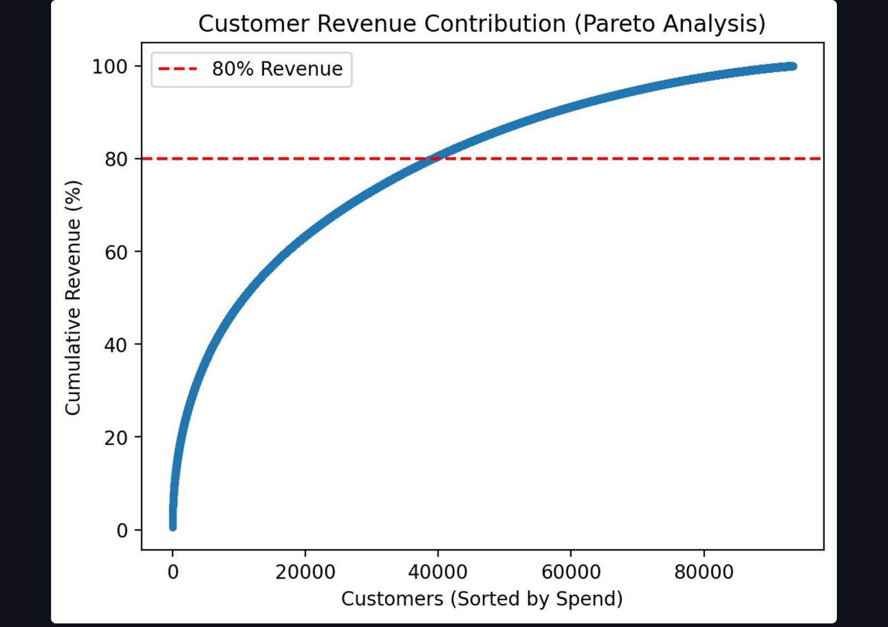
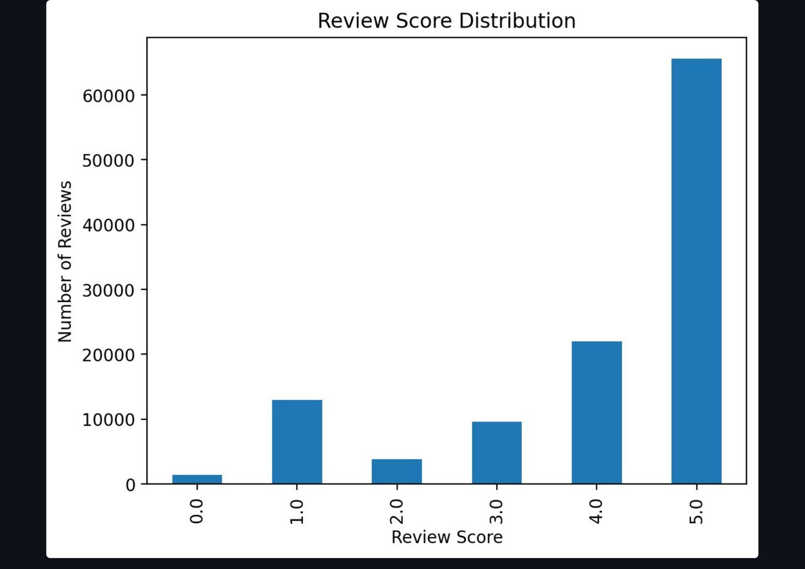
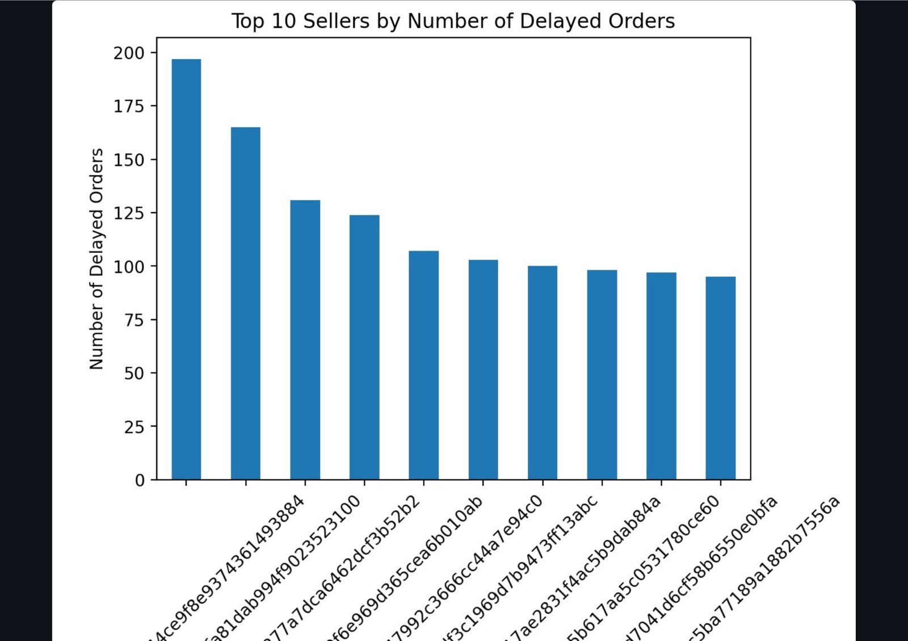
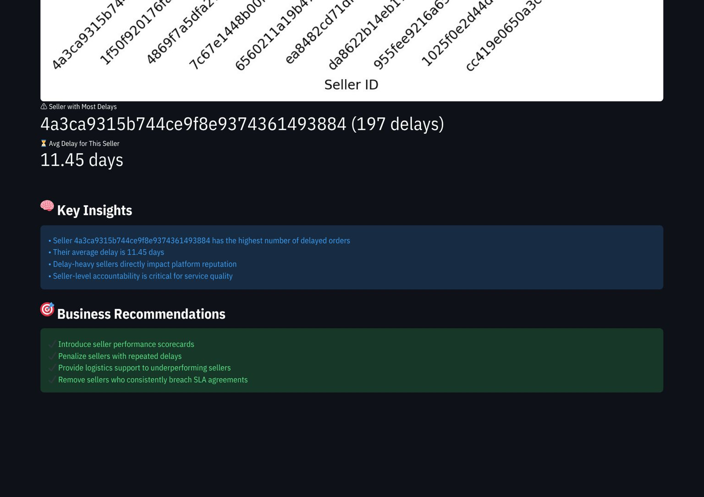

# 📊 E-Commerce Business Analytics Dashboard
### Transforming Raw Sales Data into Actionable Business Intelligence

[](https://ecommerce-business-analytics-dashboard.onrender.com/)
[](https://python.org)
[](https://streamlit.io)
[](https://github.com/tripjotsingh2505/ecommerce-business-analytics-dashboard)

---

## 🎯 Project Summary

An **end-to-end interactive analytics system** built to help e-commerce businesses understand their data — covering sales performance, customer purchasing behaviour, product demand trends, and seller reliability.

Built using **Python, SQL, Pandas, and Streamlit**, this project takes raw transactional data and converts it into a **live, deployed web dashboard** that supports data-driven business decisions.

> 💡 *This project demonstrates a full analytics workflow — from raw data to deployed product — which is the core skill expected in a Data Analyst role.*

---

## 🚀 Live Demo

🔗 **[Open Live Dashboard → ecommerce-business-analytics-dashboard.onrender.com](https://ecommerce-business-analytics-dashboard.onrender.com/)**

---

## 📌 Key Business Questions Answered

| Business Question | Insight Provided |
|---|---|
| How is revenue trending over time? | Monthly revenue trend with seasonal spike detection |
| Which product categories drive the most revenue? | Top 10 categories by total revenue |
| Who are the most valuable customers? | Pareto analysis — top customers driving 80% of revenue |
| How satisfied are customers? | Review score distribution across 65,000+ reviews |
| Which sellers have the most delays? | Top 10 sellers by delayed orders with avg delay in days |

---

## 📷 Dashboard Previews

### 📈 Monthly Revenue Trend
> Revenue shows a clear upward trajectory from 2016 to 2018, with seasonal spikes indicating strong promotional periods.



---

### 🏆 Top 10 Product Categories by Revenue
> `bed_bath_table`, `health_beauty`, and `computers_accessories` are the top 3 revenue-generating categories — reflecting a clear Pareto (80/20) distribution.



---

### 👥 Customer Revenue Contribution — Pareto Analysis
> The top ~40,000 customers contribute 80% of total revenue, highlighting the importance of targeting and retaining high-value customers.



---

### ⭐ Review Score Distribution
> Over 65,000 customers rated the platform 5 stars — a strong indicator of customer satisfaction, though 1-star reviews reveal areas for improvement.



---

### ⚠️ Seller Delay Analysis — Top 10 Delayed Sellers
> Identifies the top 10 sellers responsible for the highest number of delayed orders to support seller accountability and platform quality control.



---

### 🧠 Seller Insights & Business Recommendations
> The highest-delay seller had 197 delays with an average delay of 11.45 days — the dashboard surfaces actionable recommendations like seller scorecards and SLA enforcement.



---

## ⚙️ Features

- 📈 **Monthly Revenue Trend** — Track business growth over time with clear visual patterns
- 🏆 **Top Product Categories** — Identify highest revenue-generating product segments
- 👥 **Customer Pareto Analysis** — Pinpoint the top customers driving 80% of revenue
- ⭐ **Review Score Distribution** — Understand customer satisfaction at scale
- ⚠️ **Seller Delay Tracking** — Flag underperforming sellers with delay metrics
- 🧠 **Key Insights + Business Recommendations** — Each section includes actionable business takeaways
- 🖥️ **Interactive Streamlit Interface** — Filters and dynamic charts for exploratory analysis
- ☁️ **Live Deployed** — Accessible via public URL, no local setup required

---

## 🛠️ Technology Stack

| Layer | Tool |
|---|---|
| Language | Python 3.x |
| Dashboard Framework | Streamlit |
| Data Querying | SQL |
| Data Manipulation | Pandas, NumPy |
| Visualization | Matplotlib, Plotly |
| Deployment | Render |

---

## 📁 Project Structure

```
ecommerce-business-analytics-dashboard/
│
├── app.py                          # Main Streamlit application
├── dataset.csv                     # E-commerce transactional dataset
├── requirements.txt                # Project dependencies
├── monthly_revenue_trend.jpg       # Dashboard preview
├── top_product_categories.jpg      # Dashboard preview
├── customer_pareto_analysis.jpg    # Dashboard preview
├── review_score_distribution.jpg   # Dashboard preview
├── seller_delayed_orders.jpg       # Dashboard preview
├── seller_delays_insights.jpg      # Dashboard preview
└── README.md                       # Project documentation
```

---

## 💻 Run Locally

```bash
# Clone the repository
git clone https://github.com/tripjotsingh2505/ecommerce-business-analytics-dashboard.git
cd ecommerce-business-analytics-dashboard

# Install dependencies
pip install -r requirements.txt

# Launch the dashboard
streamlit run app.py
```

---

## 🎓 What This Project Demonstrates

- ✅ End-to-end analytics workflow (data → insight → dashboard → deployment)
- ✅ Data cleaning and transformation with Python & Pandas
- ✅ Business-focused SQL querying
- ✅ Pareto analysis, trend analysis, and seller performance tracking
- ✅ Building and deploying interactive dashboards with Streamlit
- ✅ Translating raw data into clear, actionable business recommendations

---

## 👨‍💻 Author

**Tripjot Singh**
*Data Analytics | Data Science | Machine Learning*

[](https://github.com/tripjotsingh2505)
[](https://linkedin.com/in/tripjot-singh-7a75a0284)

---

## 📜 License

This project is created for **educational and portfolio purposes**.
Feel free to explore, fork, and build on it.
