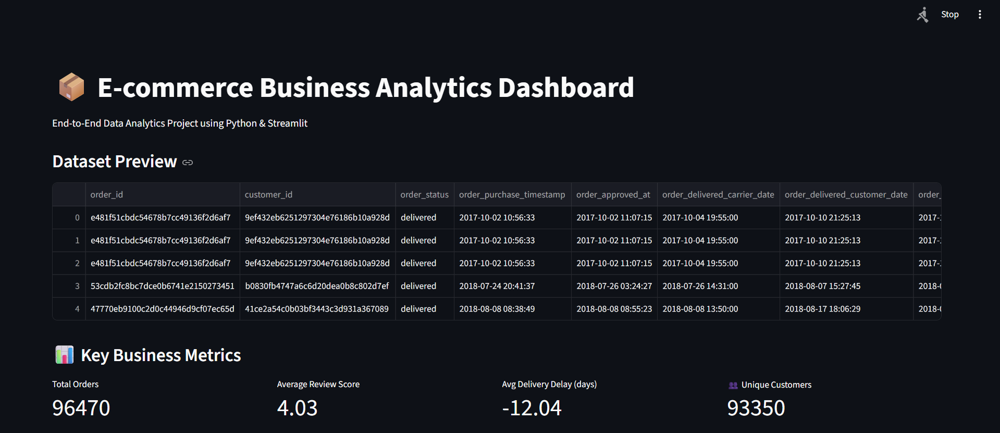

# 📊 E-commerce Business Analytics Dashboard

A **data analytics dashboard** built to analyze **e-commerce sales performance, customer behavior, and product trends**.

This project demonstrates how **SQL, Python, and Streamlit** can be used to transform raw business data into **interactive insights and visual dashboards** for decision making.

The system allows users to explore **sales metrics, revenue patterns, product performance, and customer insights** through an interactive interface.

---

# 🚀 Live Demo

Click below to open the deployed application:

🔗 **[Open Live Dashboard](https://ecommerce-business-analytics-dashboard.onrender.com/)**

---

# 📊 Project Overview

Businesses generate large amounts of transactional data every day.
However, raw data alone is difficult to interpret without proper analysis.

This project builds an **interactive analytics dashboard** that helps understand:

* overall sales performance
* customer purchasing behavior
* product demand patterns
* revenue distribution

The dashboard processes the dataset and displays **visual insights that help businesses make better strategic decisions**.

---

# ⚙️ Features

✔ Interactive **Streamlit Dashboard**
✔ Real-time **data visualization**
✔ **Sales and Revenue analysis**
✔ **Top-selling product identification**
✔ **Customer purchase behavior insights**
✔ Clean and user-friendly **analytics interface**

---

# 📈 Dashboard Insights

The dashboard provides insights such as:

### Sales Analysis

* Total sales revenue
* Sales distribution across products
* Sales trends over time

### Product Performance

* Top-selling products
* Product demand analysis
* Category-wise sales performance

### Customer Insights

* Customer purchase frequency
* Popular products among customers
* Sales contribution by customers

These insights help businesses **identify growth opportunities and optimize their strategies**.

---

# 🛠️ Technology Stack

* **Python**
* **Streamlit**
* **SQL**
* **Pandas**
* **NumPy**
* **Matplotlib / Plotly**

---

# 📁 Project Structure

```
ecommerce-business-analytics-dashboard
│
├── app.py
├── requirements.txt
├── dataset.csv
├── README.md
├── dashboard.png
```

---

# 💻 Installation

Clone the repository:

```
git clone https://github.com/tripjotsingh2505/ecommerce-business-analytics-dashboard.git
cd ecommerce-business-analytics-dashboard
```

Install dependencies:

```
pip install -r requirements.txt
```

Run the application:

```
streamlit run app.py
```

---

# 🌐 Deployment

This project can be deployed using:

* **Streamlit Community Cloud**
* **Render** *(used for this project)*
* **Heroku**

Steps:

1. Push the project to GitHub
2. Connect the repository to Render or Streamlit Cloud
3. Deploy `app.py`
4. Generate a public dashboard link

---

# 📷 Dashboard Preview



---

# 🎯 Learning Outcomes

This project demonstrates:

* **End-to-End Data Analytics Workflow**
* Data cleaning and transformation using **Python**
* Performing **SQL-based business queries**
* Building **interactive dashboards with Streamlit**
* Deploying **data analytics applications online**

---

# 👨‍💻 Author

**Tripjot Singh**

Data Analytics | Data Science | Machine Learning Enthusiast

GitHub:
https://github.com/tripjotsingh2505

---

# 📜 License

This project is created for **educational and learning purposes**.

Feel free to use and modify it.
